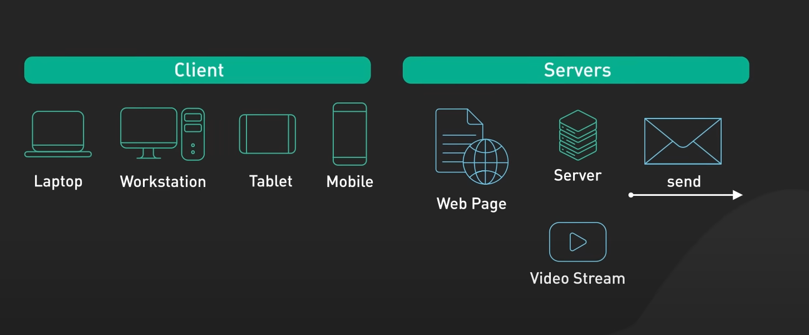
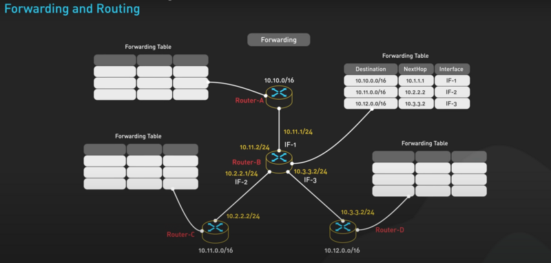
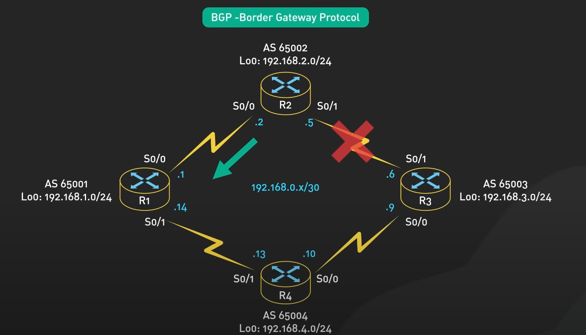
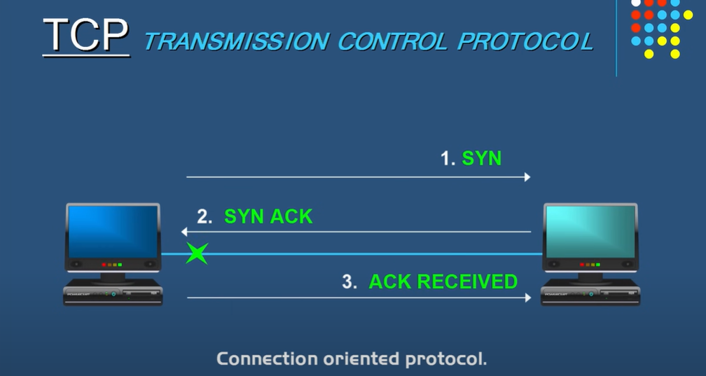
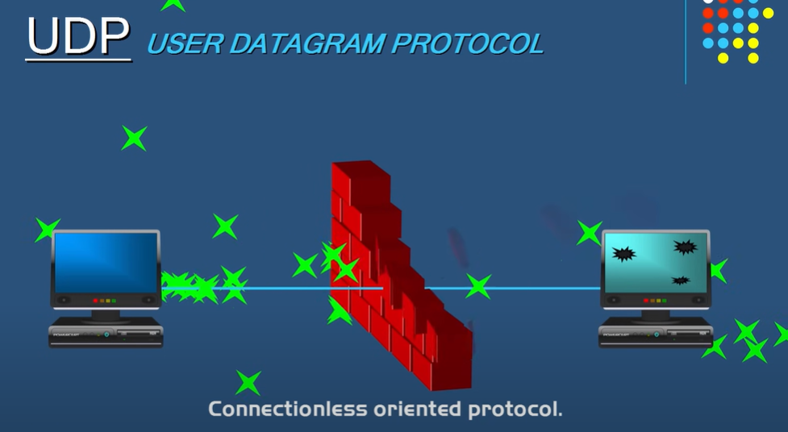

## 1. Servers and Client  
* A Server is a computer or software that provides services, data, or resources to other devices (aka Client) over a network.  
* A client is a device, software, or system that requests services, data, or resources from a server in a network. It can be a computer, smartphone, or any device that interacts with a server.

    

## 2. Forwarding  
* **Forwarding** is the process of sending a message from one node to another node in the network (Destination, Next Hop, Interface).  

* **Next Hop**: refers to the next device (router or gateway) that a packet must go through to reach its destination.  
    - Firstly, when a router receives a packet, it checks the routing table to find the best route.  
    - Next, the router forwards the packet to the next hop based on the destination IP address.  
    - This process continues until the packet reaches its final destination.  

* **Interface**: is a connection point that allows a device (such as a router, switch, or computer) to communicate.  
    - Each interface has a unique IP address and is used to connect to a network or the internet.  

    

* BGP - Border Gateway Port 
- eBGP (External)
- iBGP (Internal) 
- Purpose : 
    - Determine the best path .
    - Enable the exchange of routing information between different autonomous systems (AS) in an inter-domain or inter-network .

    

## 3 . Protocols ( most basic )

### i . TCP 
* **TCP (Transmission Control Protocol)**: is a connection-oriented protocol that ensures reliable data transfer between devices .
    * Characteristic : Connection-Oriented , Reliable Transmission , Error Checking , Flow Control , Ordered Delivery .

    *  SYN (Synchronize): The client sends a SYN request to the server .
    *  SYN-ACK (Synchronize-Acknowledgment): The server responds with a SYN .
    *  ACK (Acknowledgment): The client sends an ACK to the server .

    * Slower <> Reliable .

    

### ii . UDP 
* **UDP (User Datagram Protocol)**: is a connectionless protocol that prioritizes speed over reliability

    * Connectionless , Fast and Lightweight , No Flow Control , No Retransmission .

    * Faster <> Unreliable .

    

### iii . IP 
* **IP (Internet Protocol)**:  fundamental protocol used for addressing and routing data packets across networks . 
    * Consist 2 parts : a network address and a host address  

    * IPv4( Internet Protocol version 4 ) :
        - 32-bit address ( 4 octets ) .
        - 2^32 possible addresses ( 4,294,967,296 ) .
        - CIDR ( Classless Inter-Domain Routing ) .
    * IPv6 ( Internet Protocol version 6 ) :
        - 128-bit address ( 8 octets ) .
        - 2^128 possible addresses ( 3.4 x 10^38 ) .
        - Better Security .
    
    * Public and Private IP ( Ex : Google DNS and Home router ).

    * Static and Dynamic IP ( Ex : Server and user ).

    * How does work ? 
        - Add IP address to the data packet -> send -> get data -> handle .

### iv . HTTP 
