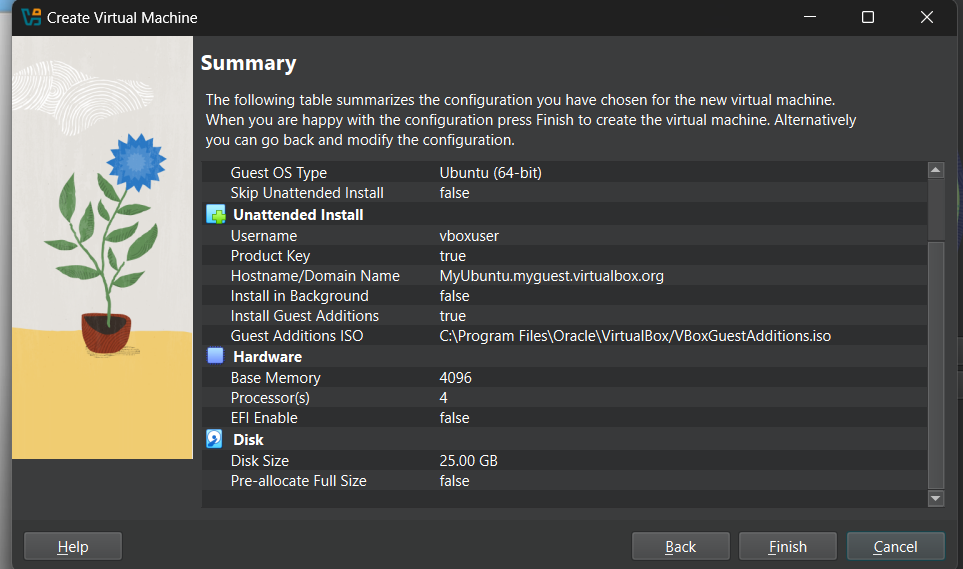

## How to setup Virtual Machine 

* Step 1 : Install [Ubuntu for Desktop](https://ubuntu.com/download/desktop) and [Oracle Virtual Box](https://www.virtualbox.org/)
* Step 2 : Finish installing VirtualBox and ensure that Hyper-V is turned off using this command.
    - ` bcdedit /set hypervisorlaunchtype off `
* Step 3 : Create a new virtual machine .
    - 
 
## Important and Popular Linux Commands

### File and Directory Management
```sh
* ls -l     - List files in long format
* ls -a     - List all files, including hidden ones
* pwd       - Print current working directory
* cd        - Change directory to home directory
* mkdir dir - Create a new directory
* rm file   - Remove a file
* rm -r dir - Remove a directory and its contents
* cp src dest   - Copy file from src to dest
* mv old new    - Rename or move a file or directory
* find /path -name "file"    - Find a file by name
```

### File Operations
```sh
* touch file    - Create an empty file
* cat file      - Display file contents
* less file     - View file with navigation
* head file     - Show the first 10 lines of a file
* tail file     - Show the last 10 lines of a file
* grep "text" file  - Search for "text" in a file
* wc -l file    - Count lines in a file
```

### User Management
```sh
* whoami    - Show current user
* id        - Display user ID and group ID
* who       - Show logged-in users
* passwd    - Change user password
* adduser user  - Create a new user
* deluser user  - Delete a user
* usermod -aG group user     - Add user to a group
```

### Process Management
```sh
* ps aux    - List all running processes
* top       - Display real-time process monitoring
* kill PID    - Terminate process with given PID (Process ID)
* killall name    - Kill all processes by name
* htop      - Interactive process viewer (if installed)
```

### Disk Usage and Monitoring
```sh
* df -h    - Show disk usage in human-readable format
* du -sh dir    - Show directory size
* free -h    - Display memory usage
* uptime    - Show system uptime and load average
```

### Networking
```sh
* ip a    - Show IP addresses
* ifconfig    - Display network interfaces (deprecated)
* ping host    - Ping a host to check connectivity
* netstat -tulnp    - Show open ports (deprecated)
* ss -tulnp    - Show open ports (replacement for netstat)
* curl url    - Fetch data from a URL
* wget url    - Download a file from a URL
```

### Package Management
```sh
* apt update    - Update package lists
* apt upgrade    - Upgrade all packages
* apt install pkg    - Install a package
* apt remove pkg    - Remove a package
```

### System Control
```sh
* shutdown -h now    - Shutdown the system immediately
* reboot    - Reboot the system
* systemctl start service    - Start a service
* systemctl stop service    - Stop a service
* systemctl restart service    - Restart a service
* systemctl status service    - Check service status
```

### File Compression and Extraction
```sh
* tar -czvf file.tar.gz dir/    - Compress a directory
* tar -xzvf file.tar.gz    - Extract a compressed tar file
* zip -r file.zip dir/    - Compress directory into a zip file
* unzip file.zip    - Extract a zip file
```

### Miscellaneous
```sh
* echo "text"    - Print text to terminal
* alias ll='ls -la'    - Create an alias
* history    - Show command history
* clear    - Clear terminal screen
```

## Network configuration check commands .

### netstat 
`netstat` (**network statistics**) is a command-line tool that displays network connections, routing tables, interface statistics, masquerade connections, and more. It is commonly used for network troubleshooting and monitoring.

#### 1. Show all active connections
```bash
netstat -a
```
Lists all active TCP and UDP connections.

#### 2. Display listening ports
```bash
netstat -l
```
Shows all open ports.

#### 3. Show processes using network connections (Linux)
```bash
netstat -tulpn
```
- `-t` → TCP connections  
- `-u` → UDP connections  
- `-l` → Listening connections  
- `-p` → Show process ID (PID)  
- `-n` → Display numerical addresses instead of resolving hostnames  

#### 4. Check network statistics
```bash
netstat -s
```
Provides a summary of network statistics, including packets sent, received, and errors.

#### 5. Monitor connections in real-time
```bash
watch netstat -an
```
Refreshes the `netstat -an` output every 2 seconds.

#### 6. Find a specific port in use
```bash
netstat -an | grep ":80"
```
Checks if port 80 is in use.

#### 7. View routing table
```bash
netstat -r
```
Displays the system's routing table.

#### Alternative to `netstat`
In newer Linux systems, `netstat` has been deprecated in favor of `ss`:
```bash
ss -tulpn
```

