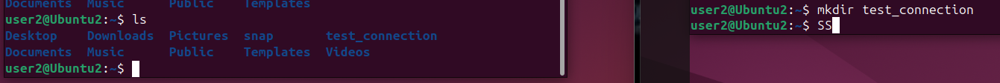

## Flow Control 
* Avoid overwhelming the receiver .
* Ensure that the sender does not overwhelm the receiver by sending data too quickly .
* How does work ?   The sender sends one packet and waits for an ACK (acknowledgment) from the receiver before sending the next packet .
* If the receiver does not receive a packet, it will send a NACK (negative acknowledgment) .
    * Sliding Window Flow Control ( TCP )
    * Stop-and-Wait 
    * Rate-based 
    * ECN ( Explicit congestion notification ) .

## Congestion control 
* Avoid overwhelming the network . 
* The sender should not send data too quickly, as this can lead to network congestion and packet loss
* How does work ?   
    * SLow start cwnd ( congest window )
    * 1 -> 2 -> 4 -> 8 (lost) -> 1 -> 2 -> 4 -> 5 -> 6. 


## SSH ( Secure Shell ):
* Secure remote access to a computer . 
* How does work ? 
    * Authentication : The client sends a login request , either using a password or SSH key .
    * Secure Channel Establishment : All communicate is encrypted by AES , RSA algorithm .
    * Remote command Execution : Once connected , tun commands on the server as if you were using directly .

## Connection SSH between 2 linux machines .
* Setting -> network -> change NAT to Bridged Adapter .
* Follow [video ](https://www.youtube.com/watch?v=rhFLfwZzlGA)

* Final .
    


## SCP (Secure Copy Protocol )
* Secure method for transferring file between computers over a network .
* Key features : 
    * Uses SSH key for authentication and encryption , ensuring secure file transfers .
    * Allows copying files and directories .
    * Works via command interface .
    * Supports password-based and key-based authentication .
* Basic SCP commands : 
    ```sh 
    * Copy file from local -> remote :
        - scp file.txt user@remote_host:/path/to/destination/
    * Copy file from remote -> local :
        - scp user@remote_host:/path/to/file.txt /local/destination/
    * Copy an entire directory :
        - scp -r user@remote_host:/path/to/directory/ /local/destination/


    ```